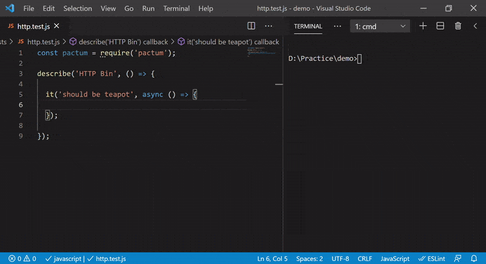

<span align="center">


# **PactumJS**


<h4>REST API Testing Tool for all levels in a Test Pyramid</h4>
<p><strong>E2E - Integration - Contract - Component</strong></p>


[](https://github.com/pactumjs/pactum/stargazers)
[](https://twitter.com/pactumjs)



</span>

## What is PactumJS?

PactumJS is a next generation free and open-source REST API automation testing tool for all levels in a [Test Pyramid](https://martinfowler.com/articles/practical-test-pyramid.html). It makes backend testing a productive and enjoyable experience. This library provides all the necessary ingredients for the most common things to write better API automation tests in an easy, fast & fun way.

The original intention of building this tool was to reuse component tests written in [frisby](https://docs.frisbyjs.com/) for contract testing with [pact](https://docs.pact.io). As you might have guessed, it was inspired from both these tools. The initial versions of this library is compatible with them but later it went on to become an independent testing tool.

## Use Cases

PactumJS users are typically Developers, QA Engineers and SDETs. It enables us to write all types of tests against backend servers (REST APIs). No matter the programming language used for building the API server, we can still use this library to write and run the tests.

> This tool will be a perfect fit for all kinds of API testing needs if you live in a world of **micro-services**.

- [General API Testing](api-testing)
- [Component Testing](component-testing)
- [Contract Testing](contract-testing)
- [Integration Testing](integration-testing)
- [E2E Testing](e2e-testing)
- [Mock Server](mock-server)

<!-- panels:start -->

<!-- div:left-panel -->

### API Testing

Tests in **pactum** are clear and comprehensive. It uses numerous descriptive methods to build your requests and expectations.

<!-- tabs:start -->

#### ** Mocha **

```js
const pactum = require('pactum');

it('should be a teapot', async () => {
  await pactum.spec()
    .get('http://httpbin.org/status/418')
    .expectStatus(418);
});

it('should save a new user', async () => {
  await pactum.spec()
    .post('/api/users')
    .withHeaders('Authorization', 'Basic xxxx')
    .withJson({
      name: 'bolt',
      email: 'bolt@swift.run'
    })
    .expectStatus(200);
});
```

#### ** Cucumber **

```gherkin
Scenario: Check Tea Pot
  Given I make a GET request to "http://httpbin.org/status/418"
  When I receive a response
  Then response should have a status 418
```

```js
// steps.js
const pactum = require('pactum');
const { Given, When, Then, Before } = require('cucumber');

let spec = pactum.spec();

Before(() => { spec = pactum.spec(); });

Given('I make a GET request to {string}', function (url) {
  spec.get(url);
});

When('I receive a response', async function () {
  await spec.toss();
});

Then('response should have a status {int}', async function (code) {
  spec.response().should.have.status(code);
});
```

<!-- tabs:end -->

<!-- div:right-panel -->

### Mock Server

**PactumJS** can act as a standalone *mock server* that allows us to mock any server via HTTP or HTTPS, such as a REST endpoint. Simply it is a simulator for HTTP-based APIs.

```js
const { mock } = require('pactum');

mock.addInteraction({
  request: {
    method: 'GET',
    path: '/api/projects'
  },
  response: {
    status: 200,
    body: [
      {
        id: 'project-id',
        name: 'project-name'
      }
    ]
  }
});

mock.start(3000);
```

<!-- panels:end -->

## Need Help

We use Github [Discussions](https://github.com/pactumjs/pactum/discussions) to receive feedback, discuss ideas & answer questions.

## Support

Like this project! Star it on [Github](https://github.com/pactumjs/pactum/stargazers) and follow on [Twitter](https://twitter.com/pactumjs). Your support means a lot to us.

### Under Development

- Contract Testing

### Experimental

- E2E Testing
- Fuzz Testing
- Snapshot Testing


### Contributors

If you've ever wanted to contribute to open source, and a great cause, now is your chance!

See the [contributing docs](https://github.com/pactumjs/pactum/blob/master/CONTRIBUTING.md) for more information.

<a href="https://github.com/pactumjs/pactum/graphs/contributors">
  
</a>
<br />

----

<a href="#/quick-start" >
  
</a>
